# Design Advanced Applications Lab

This lab consists of two subsections:
1.	Create a Function App wholly within the Azure Portal. The “serverless” app will respond to an HTTP request by storing data provided in that request to Azure Blob Storage.
2.	Create a Stream Analytics pipeline that reads data from blob storage, processes it, and routes “out-of-range” data to an Azure Service Bus topic. A second Azure Function that monitors that topic will then respond by storing the data in Blob Storage.

## Create a Function App in the Azure Portal
A Function App in Azure leverages the same infrastructure as API Apps, Web Jobs, and Web Apps, but the Azure Function portal experience is quite different. To create a Function App, search for “Function App” in the portal:

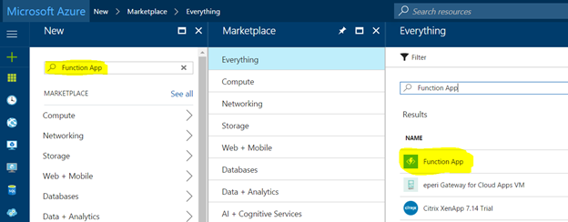

Select “Function App” from the Everything blade, and then press the Create button on the resulting informational Function App blade (not shown). You should then see the Function App Create blade, as shown below. You’ll need to populate the fields with data relevant for your account and subscription, as described by the field descriptions to the right of the image.

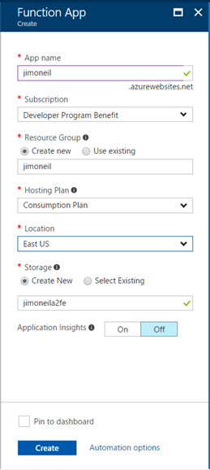
 	
 **App name:** a domain name unique across all of Azure. Note that this becomes a subdomain of azurewebsites.net, just like Web Apps, Web Jobs, and API Jobs.

**Subscription:** select the subscription in which this Function App should be created.

**Resource Group:** select (or create) the Resource Group in which the Function App will reside.

**Hosting Plan:** select “Consumption Plan” for this exercise. The Consumption Plan option charges for only the resources needed to run each invocation of your function app. An alternative is to create or use an existing App Service Plan (in which you might already be hosting a Web App or API App). In the latter case, you are being charged for the App Service Plan itself, so the Function App adds no additional cost. There are differences in the types of triggers each Hosting Plan can support, so review the documentation to determine which option will be better for your applications.

**Location:** select the Azure region

**Storage:** Function app are supported by an Azure Storage account. You can create a new one, or leverage an existing one.


Now, press Create to provision the Function App. It may take a minute or more to be created; look for the notification toast indicating completion in the upper right of the portal.

Select the newly created Function App from your list of resources in the Azure Portal; this should result in a screen similar to below:

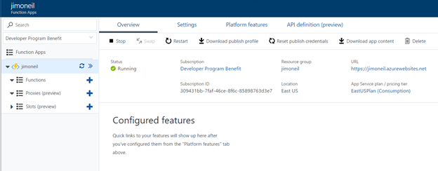

This feature-rich display allows you both to configure the Function App settings and to create new functions directly in the portal. Of course, you can also create functions in Visual Studio and other development environments and use Git integration for continuous deployment scenarios. 

Feel free to explore the Overview, Settings, Platform features, and API definition (preview) tabs; you won’t be doing any configuration here for the purposes of this short lab.

On the left sidebar, you’ll see the Function App you just created, and below that three nodes labeled Functions, Proxies (preview), and Slots (preview). We’ll be working only with the Functions node. Select it now.

The right side of the window should change to a simple interface listing your functions (none yet) and allowing you to create a new one. Select the + New function link at the top:

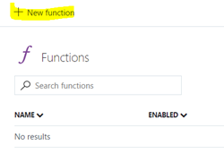
 
The screen should display a series of tiles, each representing a predefined function template for more common scenarios, such as implementing a web hook, responding to an HTTP request, or triggering an action when a message arrives in a queue. Note too that eight implementation languages are supported including C#, JavaScript, Bash scripts, and PHP. Not all templates support all languages; we’ll be using C# for this lab.

Select C# and the HTTP Trigger C# template.

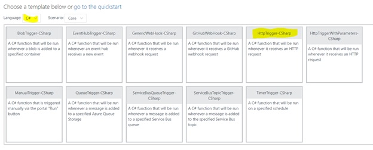

For this template, only two pieces of data are needed to create the function: a name, which becomes part of the URL, and an authentication level. Name the function Temperature and select Anonymous as the authorization level.

Note that we using a noun (Temperature) for the function name to follow REST design principals. Within the function body, you can write code to respond to the various HTTP verbs to retrieve (GET), create (POST), update (PUT/PATCH), and delete (DELETE) data.

The authorization level allows you to deny access to the API unless the caller provides either a function-specific or a master (administrative) key. You’d want to use this – or perhaps another service, Azure API Management – to control access, but that requires a bit of extra work, so for the lab just allow anonymous access to any caller that knows the URL endpoint.

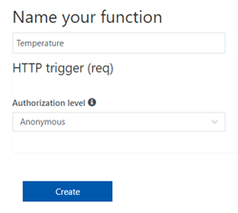

Create the function.

Once the function has been created, you should see a simple implementation of an HTTP Trigger function in the selected language (C#). On the right side bar you will see Test and View Files options; the image below has Test already selected.

This function is fully, ahem, functional. Click the Run button at the top and you should see the Output section at the bottom right populated with “Hello Azure” (or whatever you set as the value of “name” to in the Request Body section of the Test panel).

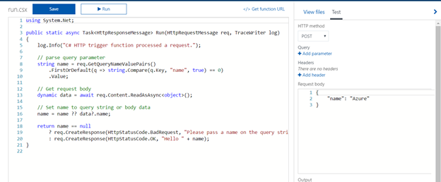

Select the Get Function URL link at the top right of the function editor. Since anonymous access is allowed you can take this URL and run it in a browser window. 

Doing so should produce an error: 

`Please pass a name on the query string or in the request body.
`

This is because the browser is sending a GET request, but there are no query parameters passed in with the URL.  Append ?name=Voldemort to the URL and you should see a result. How the result is display will depend on the browser (via content negotiation), so you may see XML, a simple string, or even a JSON object.

Congratulations! You just wrote your first Azure function!

### Store HTTP Data in Azure Blob Storage

For this next task, you’ll modify the body of the function to do something a little more interesting: store the incoming data in Azure storage. To keep things simple for the lab, you’ll use blob storage; however, the choice of storage for your specific applications will depend on a lot of factors including data velocity, variety, and volume – the three ‘V’s of big data.

When you created the Azure Function App you associated it with a new or existing storage account, so you can just use that same account here (for this throwaway exercise).

#### Configure Azure Storage

Find that storage account in your list of resources on the Azure portal and select it, then click on the Blob services tile.

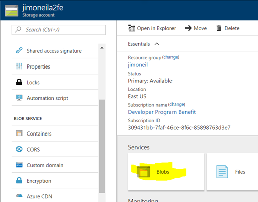

The resulting screen will show he list of blob containers (similar to folders) within your account. The one that is there now supports the Azure Function app, so add another called `temperature`.

Change the Access type to *Container* (for this lab environment only). This provides public visibility to the items in the temperature container, so you don’t have to provide keys or shared access signatures to see results.

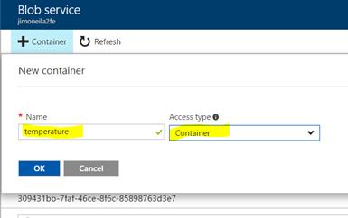

Select the newly created container and use the Upload link to browse to a small, non-sensitive text file on your machine. 

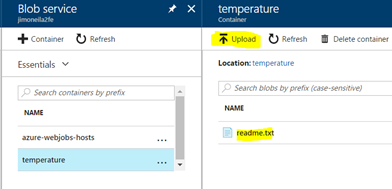

After it has uploaded, select it to bring up the Blob Properties blade (below). On that blade, copy the URL and paste it into a browser. 


You should see the contents of your text file in the browser. If you get a 404 (Not Found) error, confirm that you set the Access Type of the temperature container to Container (Blob will also work here).

You can also remove the filename from the end of the URL and add the query string `?comp=list` to see information about each of the blobs in that container (only one at the moment). Note, for this to work, the Access Type on the container must be set to Container. This completes the configuration of Azure Storage.

### Modify Azure Function
Now return to the Azure Function, and specifically the Integrate item. This exposes an interface through which you can configure bindings to triggers, inputs, and outputs. In this case the trigger (HTTP Request) was defined when you created the function definition by selecting the HTTP trigger template.

You’ll next configure a new output – to your blob container – so that the information sent via the HTTP request can be recorded in the blob storage account. To do so, consult the screen shot below, and…


1.	Select the “New” link next to the Storage account connection item and select the storage account that you configured in the previous steps. This creates an application property that points to the existing storage account.

2.	Set the blob path to `temperature/{DateTime}` to have a new blob created for each HTTP request. 

3.	Press the Save button. This creates a declarative (or configuration-driven) Azure storage output binding, but via scripting and dynamic parameter bindings you can gain further control over the storage destination.

4.	Click the *Advanced editor* link at the top right to gain direct access to the underlying function.json configuration file. Now modify the “direction” property of the outputBlob binding to inout from out. 
 
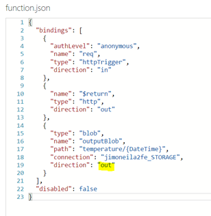

See [https://github.com/Azure/azure-webjobs-sdk-script/issues/49](https://github.com/Azure/azure-webjobs-sdk-script/issues/49) if you are curious as to why this is (currently) required.

Now, return to the Temperature function script view and replace the contents with the following script:

```csharp
// reference external assembly from C# Script
#r "Microsoft.WindowsAzure.Storage"

using System.Net;
using Microsoft.WindowsAzure.Storage.Blob;

public static async Task<HttpResponseMessage> Run(HttpRequestMessage req, CloudBlockBlob outputBlob, TraceWriter log)
{
    log.Info("C# HTTP trigger function received a request");

    // support only POST requests for this sample
    if (req.Method != HttpMethod.Post) {
        var err = "Only POST methods are allowed";
        log.Info(err);
        return req.CreateResponse(HttpStatusCode.BadRequest, err);
    }

    // get request body
    var data = await req.Content.ReadAsStringAsync();
    if (data == null) {
        var err = "Missing body in POST request";
        log.Info(err);
        return req.CreateResponse(HttpStatusCode.BadRequest, err);
    }

    // upload content to outputBlob, which was bound as an output to the function
    await outputBlob.UploadTextAsync(data);

    // create HTTP response and add Blob URI to Location header
    var res = req.CreateResponse(HttpStatusCode.OK);
    res.Headers.Add("Location", outputBlob.Uri.ToString());

    log.Info(res.Headers.Location.ToString());
    return res;
}
```


This script, *which will accept only HTTP POST* requests, creates a new blob from the HTTP request body. The data is unformatted, but it’s typical to use a JSON formatted object. To test, open the Test panel, set the HTTP method to POST, and add content to the Request body, such as below:


If you have HTTP utilities such as Postman, Fiddler, or Runscope, you can try issuing the POST request there as well.

The log file below the Function script displays the result of the call, including the endpoint of the blob that the function created:

`
017-06-11T17:52:02.512 Function started (Id=7e40bde0-ff34-4c5c-a714-1ca684363234)

2017-06-11T17:52:02.512 C# HTTP trigger function received a request

2017-06-11T17:52:02.543 https://jimoneila2fe.blob.core.windows.net/temperature/2017-06-11T17-52-02Z

2017-06-11T17:52:02.543 Function completed (Success, Id=7e40bde0-ff34-4c5c-a714-1ca684363234, Duration=22ms)
`

Paste the blob address in a browser, and you should see the content (Edge), or a file will be downloaded containing the contents (Chrome). For Chrome, if you have the JSONView plugin, it will render the content within the browser.

You’ve now completely implemented a “serverless” Azure Function that responds to an HTTP request (that could originate from any type of client application) and records the data into Azure blob storage. Although you were able to do all of the programming and configuration within the Azure portal, keep in mind that in a typical development project, all of the code and configuration files will reside in a source code repository with integration to development tools, like Visual Studio, and hooks for continuous integration and deployment to Azure.


 
## Create a Stream Analytics Pipeline
The lab creates a simple stream analytics pipeline using patterns and services that are common for IoT and other stream input scenarios. Four Azure services are involved – two of which you dealt with in the previous lab:
1.	Stream Analytics
2.	Service Bus (topics)
3.	Function App
4.	Blob Storage


 
This pipeline starts with mock incoming sensor data representing temperature measurements; these are stored in an external blob storage account for you to access, but in a true IoT application, the input would likely be coming from an IoT Hub instance to which remote sensors are reporting data.

The Temperature Validator is a Stream Analytics job that accepts the temperature data and forward any data considered out-of-bounds to a Service Bus topic for further handling. In this case, the Stream Analytics job is hard-coded to reject any temperature above 125 degrees. Note that Stream Analytics does have a mechanism for such range thresholds to be provided dynamically (namely Reference Data store in a Blob).

When a message arrives at the Service Bus, it triggers an Azure Function to then copy the out-of-range record to a Blob storage account in your own subscription. Since this architecture uses a topic, there could be other subscribers to that message that might alert a manager via text or push an alert to a dashboard display.

### Download the Lab Files
Rather than use the Azure Portal to create the services, you’ll leverage an Azure Resource Template and a PowerShell script to provision all the needed services. 

To get the lab files navigate to 

http://rebrand.ly/70-534-AdvAppsLab

and save the downloaded file. Copy the file to a directory of your choice on your local machine, and extract the contents.

You will find a LabInstructions.pdf file containing up-to-date lab instructions. 
